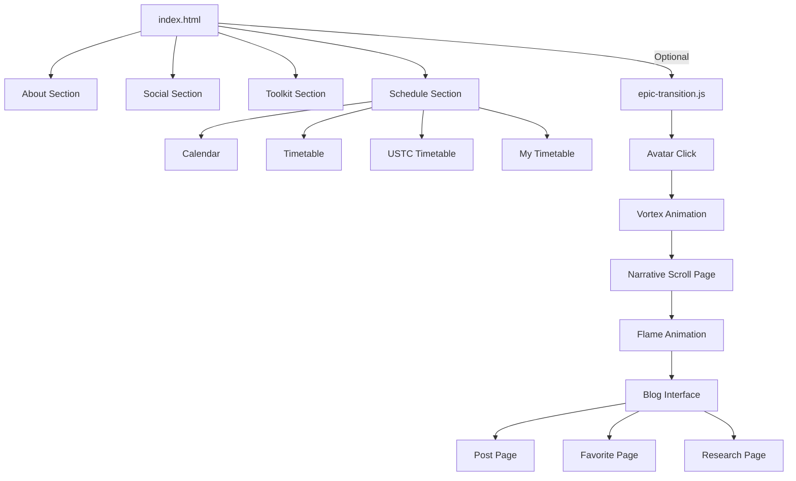

# Stardust Portfolio

**Live Demo**: [https://stardust-math.github.io/](https://stardust-math.github.io/)

## Overview

The **Stardust Portfolio** is a personal portfolio website designed to showcase my academic journey, professional experiences, and digital presence in a visually engaging and interactive manner. Built with HTML, CSS, and JavaScript, the website serves as a comprehensive platform to present my educational background, research projects, publications, skills, and social media profiles. The design emphasizes a clean, responsive layout with intuitive navigation, making it accessible across devices. An optional JavaScript component, `epic-transition.js`, introduces a dynamic, narrative-driven animation sequence to enhance user engagement, enriching the static portfolio with an immersive storytelling layer.

This project is a reflection of my academic and creative aspirations, encapsulated in the tagline: *“Turn this imperfect story into the way we hope it to be.”* It is intended for academic peers, potential collaborators, and anyone interested in exploring my work. What follows is a detailed breakdown of the project’s functionality, structure, customization methods, and design considerations to facilitate understanding and potential contributions.

## Project Structure

The repository contains two primary files and an assets directory for static resources:

- **index.html**: The core HTML file defining the website’s structure and content.
- **epic-transition.js** (optional): A JavaScript file that adds an interactive animation sequence triggered by clicking the avatar image.
- **assets/**: Directory containing static resources, organized into subdirectories:
  - **animation/**: Includes animation assets like `fire-animation.gif`.
  - **audio/**: Contains audio files like `prologue.m4a` and `fire-sound.mp3`.
  - **css/**: Covers hordes of `.css` styles corresponding to different pages.
  - **fav/** (optional): Contains several images used in `personal blog` in `epic-transition.js`.
  - **fonts/**: Includes useful `True Type` / `Open Type` font files.
  - **images/**: Stores images such as `avatar.jpg`, `background.jpg`, `old-paper-texture.jpg`, `cover_n.jpg/png`, etc.
  - **js/**: Covers different levels of `.js` files for code reference in `index.html`.

### HTML Structure (`index.html`)

The `index.html` file is a single-page application divided into four main sections, each accessible via a navigation bar. These sections are designed to provide a comprehensive view of my profile:

1. **About Section**:
   - **Purpose**: Introduces my identity, educational background, work experience, research projects, publications, and additional skills.
   - **Content**:
     - Personal details (name, contact information, location).
     - Academic history (University of Science and Technology of China, expected graduation June 2027).
     - Honors and awards (e.g., Zhang Zongzhi Sci-Tech Scholarship).
     - Work experience (e.g., Teaching Assistant for Probability Theory).
     - Research projects (ongoing, with placeholders for collaborators).
     - Publications (currently empty, to be updated).
     - Additional skills (e.g., programming proficiency in Python, LaTeX; languages; hobbies).
     - Downloadable resources (e.g., *Reference Answer of "Probability Theory and Mathematical Statistics"* and *Stardust Meditations*).
    


2. **Social Section**:
   - **Purpose**: Links to my social media profiles and content platforms.
   - **Content**: Includes links to YouTube, TikTok (Chinese), REDnote, Quora, X (Twitter), Bilibili, and GitHub, each with a brief description and profile/channel links.
  


3. **Toolkit Section**:
   - **Purpose**: Provides a curated list of tools and services I use for academic and creative work.
   - **Content**: Categorized links to tools in Development, Communication, Media & Video, Music, Knowledge, Productivity, Document and Management, and USTC Services. Each tool includes a “Visit” link for easy access.


4. **Schedule Section**:
   - **Purpose**: Displays my academic and personal schedule, including a calendar and timetable.
   - **Content**:
     - Weekly calendar view (Monday to Sunday).
     - Timetable with 13 periods across morning, afternoon, and evening.
     - Modals for adding new classes or events, with fields for period, course name, instructor, and days.
     - "USTC Timetable" and "My Timetable" for daily use.

The HTML structure leverages Bootstrap for responsive design and Font Awesome for icons, ensuring a polished and professional appearance. The layout is organized using a combination of flexbox and grid systems, with a sticky navigation bar for seamless section transitions.


### JavaScript Functionality (`epic-transition.js`)


The `epic-transition.js` file is an optional enhancement that introduces an interactive animation sequence triggered by clicking the avatar image in the About section. This feature is designed to create a memorable user experience through a narrative-driven interface. Key functionalities include:

1. **Vortex Animation**:
   - Triggered by clicking the avatar image.
   - Creates a multi-layered swirling effect centered on the avatar, using CSS gradients and animations.
   - Transitions smoothly to the narrative scroll page after completion.

2. **Narrative Scroll Page**:
   - Displays a parchment-style interface with a textured background and decorative edges.
   - Features a narrative text block with a fantasy-inspired tone.
   - Includes an interactive “Ignite” button with a flickering flame animation, accompanied by audio (narration and ambient fire sounds).

3. **Blog Interface**:
   - Accessed after the flame animation.
   - Features a responsive, multi-panel layout with three sections: Post, Favorite, and Research.
   - Includes a collapsible profile sidebar with avatar, name, and motto.
   - Supports navigation via clickable links and left/right arrows, with smooth transitions.
   - Posts and favorites are populated with placeholder content (e.g., blog posts, inspirational quotes).

4. **Audio Integration**:
   - Plays a narrative audio (`prologue.m4a`) and looping fire sound (`fire-sound.mp3`) during the scroll page.
   - Ensures single-instance audio playback with error handling.

**Note**: The JavaScript functionality is optional. If you prefer to keep the portfolio static and lightweight, you can remove the `<script src="epic-transition.js"></script>` line from `index.html` and delete the `epic-transition.js` file. This will disable the animation sequence while preserving the core portfolio functionality.

**Optional**: To disable animations, remove `<script src="epic-transition.js"></script>` from `index.html` and delete the `epic-transition.js` file.

## Customization and Modification

### Section-Specific Modifications (in ./assets/js/module)

1. **Cover Images**:
   - **Update and Change Cover Images**:
     - Change the cover images from the ./assets/images to your own and change the number, names and suffixes in `./assets/js/module/cover.js`.

2. **About Section (in ./assets/js/module/resume.js)**:
   - **Update Personal Information**:
     - Edit the `<div class="col-md-4">` containing name, address, email, and phone number.
     - Example: Change `Jinghao Chen` to your name by modifying the `<h2>` text.
   - **Add Education Entry**:
     - Duplicate the `<div>` under `<h3>Education</h3>` and update institution, dates, and degree details.
   - **Add Award**:
     - Append a new `<li>` under `<ul>` in the `<h3>Honors and Awards</h3>` section.
   - **Add Work Experience**:
     - Duplicate the `<div>` under `<h3>Work Experience</h3>` and update role, dates, and description.
   - **Add Research Project**:
     - Duplicate the `<div>` under `<h3>Research Projects</h3>` and fill in project details and collaborators.
   - **Add Publication**:
     - Populate the `<div>` under `<h3>Publications</h3>` with citation details in a consistent format.
   - **Update Skills**:
     - Modify the `<ul>` under `<h3>Additional Skills/Information</h3>` to reflect your skills, languages, or hobbies.
   - **Update Download Links**:
     - Replace `href` attributes in `<a>` tags with paths to your files.

3. **Social Section (in ./assets/js/module/social.js)**:
   - **Add Social Media Profile**:
     - Duplicate a `<div class="col-md-4">` block under `<div class="row social-links">`.
     - Update the platform name, description, and links (e.g., `href="your-profile-url"`).
   - **Remove Profile**:
     - Delete the `<div class="col-md-4">` block for the platform you wish to remove.
   - **Update Links**:
     - Modify `href` attributes to point to your profiles or handles.

4. **Toolkit Section (in ./assets/js/module/toolkit.js)**:
   - **Add Tool Category**:
     - Duplicate a `<div class="toolkit-category">` block.
     - Update the `<h3>` title and add new `<div class="col-md-4">` blocks for tools.
   - **Add Tool**:
     - Duplicate a `<div class="col-md-4">` block within a category.
     - Update the tool name, image, and `href` in the `<a>` tag.
   - **Remove Tool/Category**:
     - Delete the specific `<div class="col-md-4">` or `<div class="toolkit-category">` block.

5. **Schedule Section (in ./assets/js/module/schedule.js)**:
   - **Update Calendar**:
     - Modify the `<div class="week-display">` text to reflect the desired week.
   - **Add Class/Event**:
     - For static entries, add rows to the timetable `<table>` or classes `<table>` with appropriate details.
     - For dynamic additions, rely on the modal forms (`#add-class-modal`, `#add-event-modal`) and ensure JavaScript handles form submissions (not implemented in the provided code).
   - **Modify Modal Forms**:
     - Update options in `<select>` elements for `Period Start` and `Period End` to match your schedule structure.
     - Add or remove days in the `<div class="days-checkboxes">` block.
   - **Modify Personal Courses**:
     - Fill in, modify and integrate the course information according to the existing information in the code.

### Visual Diagram
Below is a simplified diagram illustrating the website’s structure and optional JavaScript flow:



## Deployment Instructions

1. **Clone the Repository**:
   ```bash
   git clone https://github.com/your-username/your-repository.git
   cd your-repository
   ```

2. **Add Assets**:
   - Place images, audio files, and other resources in the `assets/` directory.
   - Update paths in `index.html` and `epic-transition.js` to match.

3. **Host Locally**:
   - Use a local server (e.g., `python -m http.server` or Live Server in VS Code) to test the website.
   - Ensure all assets load correctly.

4. **Deploy to GitHub Pages**:
   - Push the repository to GitHub.
   - Enable GitHub Pages in the repository settings, selecting the `main` branch and `/ (root)` directory.
   - Access the site at `https://your-username.github.io/your-repository`.

## Limitations and Future Improvements

This project, while functional, is a static website with limited dynamic interactivity in its base form. The HTML structure relies on Bootstrap, which may increase load times for users with slow connections. The JavaScript animation sequence, while visually engaging, may not be suitable for all audiences due to its resource-intensive nature and reliance on external assets (e.g., audio, images). Future improvements could include:
- Implementing a backend (e.g., Node.js, Firebase) for dynamic content updates.
- Adding accessibility features (e.g., screen reader support, keyboard navigation).
- Optimizing animations for low-end devices.
- Expanding the blog interface with real content and database integration.

## Conclusion

The Stardust Portfolio is a personal endeavor to present my academic and creative journey in a structured and visually appealing manner. I have strived to create a project that is both functional and inspirational, reflecting my commitment to turning an “imperfect story” into something meaningful. While the project has limitations, such as its static nature and dependency on external libraries, I hope it serves as a useful resource for others looking to build similar portfolios. I welcome feedback and contributions to enhance its functionality and accessibility. Thank you for exploring this project, and I hope it inspires you in your own endeavors.
